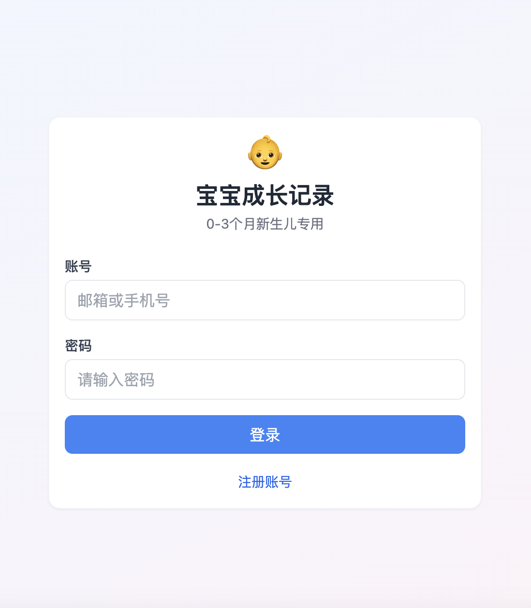
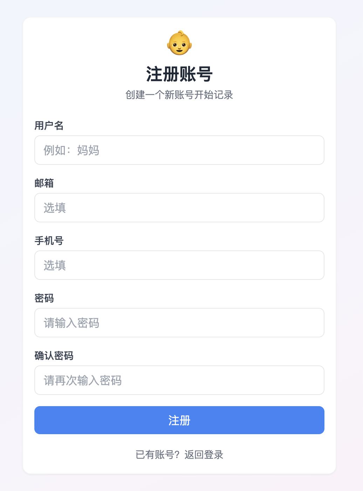
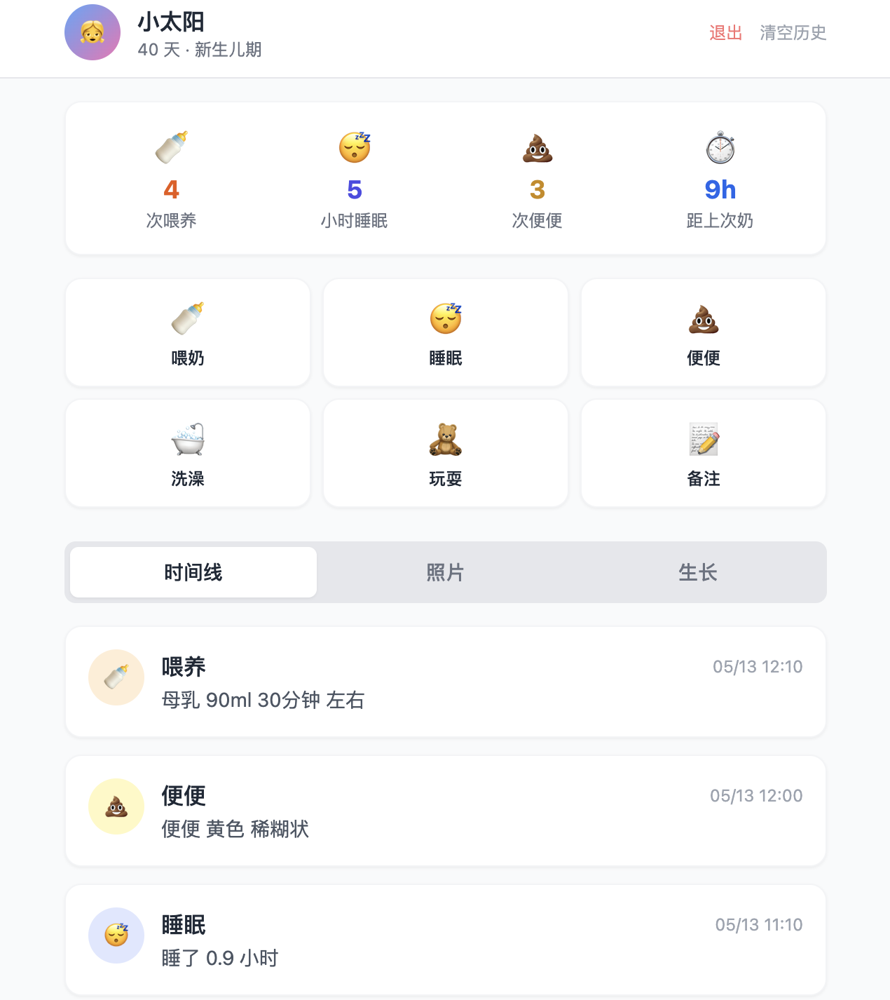

# 宝宝成长记录 (Baby Tracker)

一款专为 0-3 个月新生儿设计的成长记录工具，支持喂养、睡眠、便便、洗澡、玩耍、生长曲线及照片记录。

---

## 界面效果图

  

---

## 技术架构

| 层级 | 技术栈 |
|------|--------|
| 前端 | React 18 + Vite + Tailwind CSS |
| 后端 | Node.js + Express + Prisma ORM |
| 数据库 | SQLite (开发) |
| 部署 | 本地开发服务器 |

---

## 目录结构

```
baby-tracker/
├── backend/                 # 后端 API
│   ├── prisma/
│   │   ├── schema.prisma    # 数据库模型定义
│   │   └── dev.db           # SQLite 数据库文件
│   ├── src/
│   │   ├── index.ts         # Express 入口
│   │   ├── prisma.ts        # PrismaClient 单例
│   │   └── routes/
│   │       ├── users.ts     # 用户注册/登录
│   │       ├── babies.ts    # 宝宝 CRUD
│   │       ├── records.ts   # 记录 CRUD + 统计
│   │       ├── photos.ts    # 照片上传
│   │       ├── milestones.ts# 里程碑
│   │       └── growth.ts    # 生长记录
│   └── package.json
├── frontend/                # 前端 SPA
│   ├── src/
│   │   ├── main.tsx         # 应用入口
│   │   ├── App.tsx          # 路由/状态管理
│   │   ├── api.ts           # API 封装
│   │   ├── index.css        # Tailwind + 自定义样式
│   │   └── components/
│   │       ├── Login.tsx    # 登录页
│   │       ├── Register.tsx # 注册页
│   │       ├── BabySetup.tsx# 添加宝宝
│   │       └── Dashboard.tsx# 主面板
│   └── package.json
└── README.md
```

---

## 功能模块

### 1. 用户系统
- **注册**：支持邮箱或手机号注册，密码 bcrypt 加密存储
- **登录**：账号（邮箱/手机号）+ 密码登录
- **退出**：清除本地登录态并返回登录页

### 2. 宝宝管理
- 添加宝宝：昵称、出生日期、性别、出生体重/身高
- 自动计算：根据出生日期显示当前天数及阶段（新生儿期/婴儿期）
- 登录后自动恢复：若用户已有宝宝，自动进入 Dashboard

### 3. 记录类型
| 类型 | 记录字段 |
|------|----------|
| 喂奶 | 喂养方式（母乳/配方奶/混合）、奶量(ml)、时长(分钟)、左胸/右胸 |
| 睡眠 | 开始时间、结束时间（自动计算睡眠时长） |
| 便便 | 类型（尿尿/便便/都有）、颜色、性状 |
| 洗澡 | 备注 |
| 玩耍 | 时长(分钟)、备注 |
| 备注 | 文字备注 |

### 4. 今日统计
- 喂养次数
- 睡眠总时长（小时）
- 便便次数
- 距上次喂奶时间

### 5. 照片记录
- 上传照片（存储于 `backend/uploads/photos/`）
- 照片网格展示

### 6. 生长曲线
- 记录日期、体重(kg)、身高(cm)、头围(cm)
- 历史记录列表

---

## 本地开发环境搭建

### 前置要求
- Node.js >= 18
- npm

### 1. 启动后端

```bash
cd backend
npm install
# 数据库已内置，无需额外配置
npm run dev
```

后端默认运行在 `http://localhost:3001`

### 2. 启动前端

```bash
cd frontend
npm install
npx vite --port 5173 --host
```

前端默认运行在 `http://localhost:5173`

### 3. 访问应用

浏览器打开 `http://localhost:5173`

---

## 生产部署建议

### 后端部署
1. **服务器**：阿里云 ECS / 腾讯云 CVM / Railway / Render
2. **数据库迁移**：SQLite 仅适合单机开发，生产建议迁移到 **PostgreSQL** 或 **MySQL**
   - 修改 `prisma/schema.prisma` 中的 `datasource db` 配置
   - 执行 `npx prisma migrate deploy`
3. **环境变量**：使用 `.env` 配置 `DATABASE_URL` 和 `PORT`
4. **进程守护**：使用 `pm2` 或 `systemd` 保持服务运行
5. **反向代理**：Nginx + HTTPS（微信小程序强制要求 HTTPS）
6. **文件存储**：照片上传目前存于本地磁盘，生产建议使用 **OSS**（阿里云/腾讯云）

### 前端部署
- 执行 `npm run build` 生成静态文件
- 通过 Nginx / CDN / Vercel 部署 H5 页面

---

## 微信小程序迁移方案分析

当前技术栈为 **React Web SPA**，迁移到微信小程序有以下几种路径：

### 方案一：WebView 内嵌（最快上线，推荐 MVP 验证）

**思路**：小程序仅提供一个页面，内嵌 `<web-view>` 加载已部署的 H5。

**优点**：
- 现有代码零改动，最快 1 天上线
- 功能与 H5 完全一致

**缺点**：
- 顶部有微信导航栏，体验不如原生小程序
- 部分微信能力（如通知、扫码）调用受限
- 用户分享路径固定，无法做精细化运营

**实施步骤**：
1. 将前后端部署到公网服务器，配置 HTTPS 域名
2. 注册微信小程序，配置业务域名
3. 小程序代码仅需一个页面：
   ```xml
   <web-view src="https://your-domain.com" />
   ```

---

### 方案二：Taro 迁移（推荐长期维护）

**思路**：使用 [Taro 3](https://taro.jd.com/)（京东开源的多端框架）将 React 代码编译为微信小程序。

**优点**：
- 保留 React 开发范式，代码复用率高
- 一套代码可同时编译为 H5 + 小程序 + App
- 社区活跃，京东、滴滴等大厂在用

**需要改动的点**：
| 现有技术 | 小程序适配 |
|----------|-----------|
| `fetch` | 替换为 `Taro.request` |
| `localStorage` | 替换为 `Taro.setStorageSync` |
| `FormData` 上传照片 | 替换为 `Taro.uploadFile` |
| Tailwind CSS | 需改用 Taro 支持的样式方案（如 taro-ui 或自定义） |
| DOM 事件 | 改为 Taro 的事件系统 |
| 路由 | 改为 Taro 路由 API |

**预估工作量**：2-3 周（1 人）

---

### 方案三：uni-app 重写（跨端最优）

**思路**：使用 [uni-app](https://uniapp.dcloud.net.cn/) 重写前端，Vue 语法，一套代码输出到小程序、H5、App。

**优点**：
- 跨端能力最强，一次开发多端运行
- 国内生态完善，插件市场丰富
- 更适合中国开发者习惯

**缺点**：
- 需要将 React 重写为 Vue，工作量较大
- 现有 React 组件无法直接复用

**预估工作量**：3-4 周（1 人）

---

### 方案四：原生重写（体验最佳，成本最高）

**思路**：使用微信原生开发框架（WXML + WXSS + JS/TS）重写。

**优点**：
- 性能最优，微信官方能力支持最全
- 包体积最小，加载最快

**缺点**：
- 完全重写前端，工作量最大
- 无法复用到 H5 或其他平台

**预估工作量**：4-6 周（1 人）

---

## 推荐路线

| 阶段 | 目标 | 方案 |
|------|------|------|
| **第一阶段（现在）** | 快速验证产品价值 | 部署 H5 + WebView 小程序 |
| **第二阶段（验证后）** | 优化小程序体验 | Taro 3 迁移，保留 React 技术栈 |
| **第三阶段（规模化）** | 多端统一 | 考虑 uni-app 或持续维护 Taro |

---

## 注意事项

1. **数据库**：当前使用 SQLite，生产环境务必迁移到 PostgreSQL/MySQL，并配置定期备份
2. **图片存储**：生产环境建议接入云存储（OSS/COS），避免服务器磁盘满
3. **用户密码**：已使用 bcrypt 哈希存储，符合安全规范
4. **微信小程序**：上线前需完成微信认证、备案域名、HTTPS 配置
